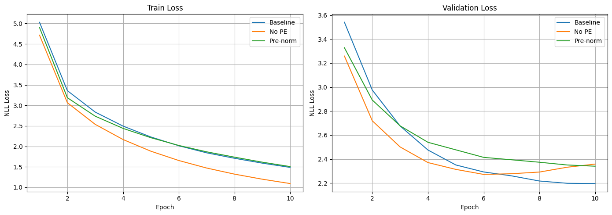

# aiayn_rep
# Transformer from Scratch — *Attention is All You Need*

A faithful PyTorch implementation of the Transformer architecture from [Vaswani et al. (2017)](https://arxiv.org/abs/1706.03762), built entirely from scratch without using `torch.nn.Transformer` or any HuggingFace model classes. Trained on English→German translation (Multi30k) with ablation studies on two core architectural design choices.

---

## Overview

This project covers the full stack of building and studying a Transformer:

- Every architectural component implemented from scratch in PyTorch — embeddings, sinusoidal positional encoding, scaled dot-product attention, multi-head attention, position-wise feed-forward networks, layer normalization, encoder/decoder stacks, and the final projection layer
- BPE tokenization trained from scratch on the Multi30k corpus using HuggingFace `tokenizers`
- Training with the paper's exact Adam configuration and warmup+decay learning rate schedule
- Greedy decoding for inference, BLEU evaluation via `sacrebleu`
- Ablation studies comparing: (1) with vs. without positional encoding, (2) post-norm vs. pre-norm residual connections

---

## Repository Structure

```
├── transformer_colab.ipynb   # Self-contained Colab notebook (run this)
├── transformer.py            # All model architecture classes + build_transformer()
├── dataset.py                # causal_mask, BPE tokenizer builder, BilingualDataset
├── build_data.py             # Multi30k loading, tokenizer caching, DataLoader construction
├── train.py                  # LR schedule, training loop, validation, checkpointing
├── evaluate.py               # Greedy decoding, BLEU computation, sample translation printer
└── loss_curves.png           # Train/val loss curves for all three experimental runs
```

---

## Architecture

Follows the base model configuration from the original paper:

| Component | This implementation | Paper (base model) |
|-----------|--------------------|--------------------|
| Model dimension `d_model` | 256 | 512 |
| Encoder/Decoder layers `N` | 2 | 6 |
| Attention heads `h` | 4 | 8 |
| FFN inner dimension `d_ff` | 512 | 2048 |
| Dropout | 0.1 | 0.1 |
| Positional encoding | Sinusoidal (fixed) | Sinusoidal (fixed) |
| Tokenization | BPE (~9.5k / 10k vocab) | BPE (~37k shared vocab) |

The model dimension and layer count are reduced from the paper's base configuration due to compute constraints (free Colab T4 GPU). All other architectural and training decisions match the paper faithfully. The paper's base model achieves 27.3 BLEU on WMT14 En-De; this implementation achieves 23.27 on Multi30k, a smaller and simpler dataset.

### Key implementation details

**Residual connections** follow post-norm ordering (matching the original paper):
```
x = LayerNorm(x + Dropout(Sublayer(x)))
```

**Learning rate schedule** matches the paper's formula exactly:
```
lr = d_model^(-0.5) * min(step^(-0.5), step * warmup_steps^(-1.5))
```
with `warmup_steps=200`, stepped per batch not per epoch.

**Adam hyperparameters** match the paper: `β1=0.9`, `β2=0.98`, `ε=1e-9`.

**Masking**: encoder uses a padding mask `(1, 1, seq_len)`; decoder combines a causal mask and padding mask into `(1, seq_len, seq_len)`, both broadcast correctly over the `(batch, heads, seq, seq)` attention score tensor.

---

## Dataset & Tokenization

**Dataset**: [bentrevett/multi30k](https://huggingface.co/datasets/bentrevett/multi30k) — ~29,000 English-German image caption pairs (train=29,000, val=1,014).

**Why Multi30k**: chosen for its small size and short sentences (max 48 BPE tokens in training split), allowing full training runs within a single Colab GPU session while still producing meaningful BLEU scores and qualitative translations. The architecture is dataset-agnostic — scaling to WMT14 requires only a data pipeline change.

**Tokenization**: separate BPE tokenizers trained from scratch on the training split only (no val/test leakage), using HuggingFace `tokenizers` with `vocab_size=10,000` and `min_frequency=2`. BPE is chosen over word-level tokenization because it eliminates true OOV tokens by falling back to subword pieces, which is especially important for German's productive compound morphology (e.g. *Eisfischerhütte* → subword pieces rather than `[UNK]`). This matches the tokenization approach in the original paper.

---

## Training

```
Optimizer : Adam (β1=0.9, β2=0.98, ε=1e-9)
LR schedule: warmup + inverse square root decay (warmup_steps=200)
Loss       : NLLLoss with ignore_index=[PAD]
Epochs     : 10
Batch size : 128
```

Loss curves for all three experimental runs:



---

## Results

### Quantitative (BLEU on Multi30k validation set)

| Model | Val Loss | BLEU |
|-------|----------|------|
| Baseline (post-norm + PE) | 2.1959 | **23.27** |
| Pre-norm (pre-norm + PE) | 2.3407 | 21.26 |
| No PE (post-norm, no PE) | 2.3582 | 14.73 |

BLEU computed with `sacrebleu`. Minor BPE detokenization artifacts (space before punctuation) affect absolute scores equally across all three variants and do not affect relative comparisons.

### Qualitative (sample baseline translations)

| Source (EN) | Predicted (DE) | Reference (DE) |
|-------------|---------------|----------------|
| A man sleeping in a green room on a couch. | Ein Mann schläft in einem grünen Raum auf einem Sofa . | Ein Mann schläft in einem grünen Raum auf einem Sofa. |
| A boy wearing headphones sits on a woman's shoulders. | Ein Junge mit Kopfhörern sitzt auf den Schultern einer Frau . | Ein Junge mit Kopfhörern sitzt auf den Schultern einer Frau. |
| A group of men are loading cotton onto a truck | Eine Gruppe von Männern entladen einen Lastwagen . | Eine Gruppe von Männern lädt Baumwolle auf einen Lastwagen |
| Two men setting up a blue ice fishing hut on an iced over lake | Zwei Männer richten eine blaue Schlauch booten hoch über einen See . | Zwei Männer bauen eine blaue Eisfischerhütte auf einem zugefrorenen See auf |

The model handles common syntactic structures well (sentences 1-2 are near-perfect). Errors concentrate on rare domain-specific compounds (*Eisfischerhütte*) and low-frequency verb distinctions (*laden* vs *entladen*), consistent with the limits of a small vocabulary and dataset.

---

## Ablation Studies

### 1. Positional Encoding: With vs. Without

**Change**: `PositionalEncoding.forward` skips adding the `pe` buffer — the model receives only token embeddings with no positional signal. All other components, hyperparameters, and training conditions are identical.

**Results**: removing PE drops BLEU from 23.27 to 14.73 (−8.54 points). The validation loss curve shows visible divergence from epoch 7 onward (val loss rising while training loss continues falling), a clear overfitting signature absent in the baseline. Without positional information, self-attention treats the input as a set rather than a sequence — the model compensates by memorizing token co-occurrence statistics more aggressively, which generalizes poorly to unseen sentences.

The gap would likely be larger on longer, more syntactically complex sentences (e.g. WMT14 news text) where word order is more critical. On Multi30k's short captions, some translation signal survives even without positional encoding, explaining why the no-PE model still outperforms random initialization.

**Takeaway**: positional encoding is not a cosmetic addition — it provides the only source of sequence order information in an architecture whose core operation (attention) is otherwise permutation-invariant.

### 2. Normalization Position: Post-Norm vs. Pre-Norm

**Change**: `EncoderBlock` and `DecoderBlock` apply `LayerNorm` before each sublayer instead of after:
```python
# Post-norm (original paper, baseline)
x = LayerNorm(x + Dropout(Sublayer(x)))

# Pre-norm (modern default: GPT, T5, LLaMA)
x = x + Dropout(Sublayer(LayerNorm(x)))
```
A final `LayerNorm` is added after the last block in pre-norm (necessary because each block no longer ends with a norm).

**Results**: post-norm (baseline) outperforms pre-norm by 2.01 BLEU (23.27 vs 21.26) at this scale. This is consistent with the literature — Xiong et al. (2020) show pre-norm's stability advantage emerges primarily at greater depth (6+ layers). With only 2 layers and 10 epochs, post-norm's tighter activation regularization (normalizing after the residual keeps activations in a tighter range) is actually beneficial. Notably, pre-norm's val loss was still decreasing at epoch 10 (no plateau), while baseline had converged — suggesting pre-norm may close or reverse the gap with longer training.

**Takeaway**: pre-norm is not universally better — it is better *at scale and depth*, which is why it became the standard in large modern transformers. At shallow depth and limited training, post-norm can be competitive or superior.

---

## How to Run

### In Google Colab (recommended)

1. Upload `transformer_colab.ipynb` to [colab.research.google.com](https://colab.research.google.com)
2. Set runtime to **T4 GPU** (Runtime → Change runtime type)
3. Run cells top to bottom — each cell is labeled and self-contained
4. Full run (baseline + 2 ablations + evaluation) takes ~45-60 minutes on T4

### Locally

```bash
pip install torch datasets tokenizers sacrebleu
```

Run in order:
```python
# 1. Build data pipeline
from build_data import build_dataloaders
train_loader, val_loader, tokenizer_src, tokenizer_tgt = build_dataloaders()

# 2. Build model
from transformer import build_transformer
model = build_transformer(
    src_vocab_size=tokenizer_src.get_vocab_size(),
    tgt_vocab_size=tokenizer_tgt.get_vocab_size(),
    src_seq_len=128, tgt_seq_len=128,
    d_model=256, N=2, h=4, d_ff=512, dropout=0.1,
)

# 3. Train
from train import run_training
history = run_training(model, tag='baseline')

# 4. Evaluate
from evaluate import run_evaluation
bleu, _, _ = run_evaluation(model, val_loader, tokenizer_tgt, 128, device)
print(f'BLEU: {bleu:.2f}')
```

---

## Design Decisions & Honest Limitations

**Why separate tokenizers (not shared vocabulary)**: separate BPE tokenizers per language are simpler to reason about and implement correctly. The original paper uses a shared ~37k BPE vocabulary for En-De, which additionally enables weight tying between source/target embeddings and the projection layer — a natural next step.

**Why greedy decoding (not beam search)**: greedy decoding is sufficient to demonstrate translation quality and evaluate architectural differences. Beam search would improve absolute BLEU scores (typically +1-3 points) but adds implementation complexity without changing the relative conclusions of the ablation study.

**Why post-norm by default**: matches the original paper. Pre-norm is provided as an ablation variant. For a production or larger-scale reimplementation, pre-norm would be the recommended default.

**Compute constraint**: model dimensions are reduced from the paper's base configuration (d_model 512→256, N 6→2, d_ff 2048→512) to fit training within a free Colab T4 session. The architecture is correct at any dimension — scaling up requires only changing the `build_transformer` arguments.

---

## References

- Vaswani et al. (2017). [Attention Is All You Need](https://arxiv.org/abs/1706.03762)
- Xiong et al. (2020). [On Layer Normalization in the Transformer Architecture](https://arxiv.org/abs/2002.04745)
- Sennrich et al. (2016). [Neural Machine Translation of Rare Words with Subword Units](https://arxiv.org/abs/1508.07909) — BPE tokenization
- Post (2018). [A Call for Clarity in Reporting BLEU Scores](https://arxiv.org/abs/1804.08771) — sacrebleu
